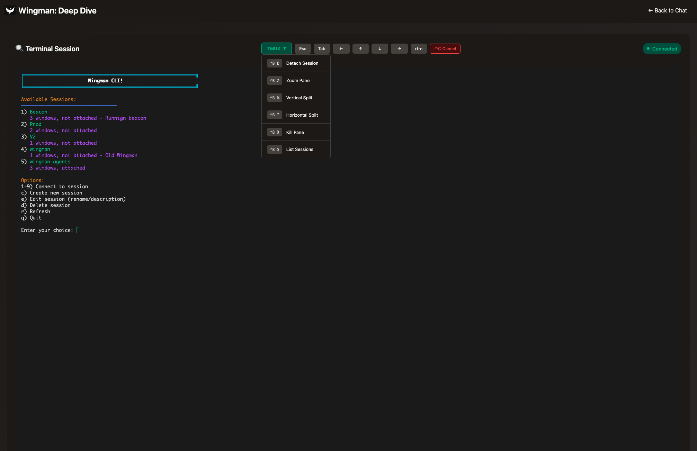
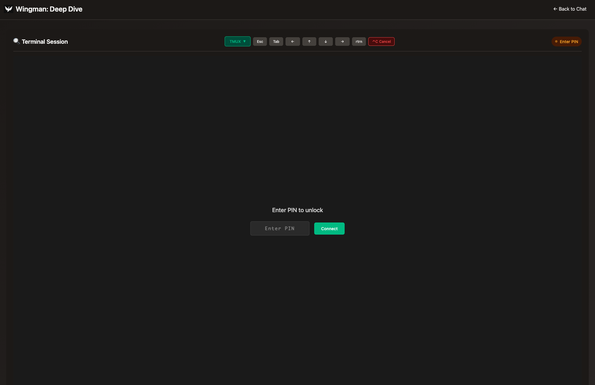

# Deep Dive Terminal Implementation

The deep dive terminal is a browser-based tmux client that reuses the Wingman CLI inside a pseudo-terminal and streams it over WebSockets. This document explains every moving part so you can rebuild the same experience in another project.

Here is the UI Look and Feel (althoguh we'll want the current Header from Wingmen)

On load we show a simple pin.

In use we will allow direct typing into the terminal and we have special commands that can be inserted into the terminal directly. 

## Runtime Components

- **HTTP route** – `src/server.ts` serves `public/deep-dive.html` and exposes `GET /deep-dive/config.json` so the browser knows where to open the WebSocket.
- **Browser client** – `public/deep-dive.html` hosts the UI, loads `@xterm/xterm`, and runs `public/deep-dive.js`, which handles PIN entry, socket lifecycle, TMUX shortcuts, and copy helpers.
- **WebSocket service** – `scripts/deep-dive-terminal-server.js` runs as a separate Node process (spawned from the Bun orchestrator) and listens for connections on `/deep-dive/socket`.
- **PTY bridge** – the Node service uses `node-pty` to spawn a login shell (defaulting to `$SHELL` on Unix) and proxies its stdio back through JSON events.
- **Wingman bootstrap** – once the pseudo-terminal is live, the server writes `process.env.TERMINALCMD || 'node wingman-cli.js'` so the CLI starts automatically. This loads the Wingman tmux helper menu. 

## Browser Implementation Details (`public/deep-dive.html`)

1. **PIN gate** – `TerminalClient.setupPinEntry()` displays an overlay asking for the PIN; the value is sent with `socket.emit('authenticate', pin)`. The overlay hides only after the server replies with `auth-success`.
2. **Terminal widget** – `setupTerminal()` instantiates an `xterm.js` `Terminal`, wires `onData` to emit keystrokes, and `onResize` to forward new dimensions. A resize helper inspects the container, adjusts columns/rows, and switches fonts for mobile viewports.
3. **Clipboard + paste** – `copyTerminalContent()` reads either the current selection or the full visible buffer and uses the async clipboard API (with a textarea fallback). `pasteToTerminal()` normalises newline characters and submits the text via `terminal-input`.
4. **TMUX assist controls** – `setupTmuxControls()` enables a dropdown and quick buttons. The helper emits control sequences (for example, `Ctrl+B` followed by `d` for detach) and arrow/Shift+Tab escape codes so touch users can drive tmux panes.
5. **Socket lifecycle** – `setupSocket()` connects to `/terminal`, updates the status indicator, and reacts to:
   - `auth-required` / `auth-success` / `auth-failed` – toggle the PIN overlay and, upon success, kick off `start-terminal` with the current terminal size.
   - `terminal-output` – append data to the xterm instance.
   - `terminal-error` – render error messages in red.
   - Disconnections – reset authentication state and prompt for PIN again.

## Server Implementation Details (`scripts/deep-dive-terminal-server.js`)

1. **Upgrade handling** – an `http` server listens for `/deep-dive/socket` upgrades and hands them to `ws`.
2. **Auth state** – per-socket state tracks `authenticated` + timestamp. The PIN (default `'1234'`) and timeout (`PIN_TIMEOUT`, default 45 seconds) come from env vars.
3. **Session lifecycle** – on `start-terminal` the server:
   - Verifies the socket is authenticated.
   - Kills any existing PTY for that client.
   - Spawns a shell via `pty.spawn(...)` with the received `cols`/`rows` and inherits `process.env`.
   - Subscribes to `onData` to forward stdout as `terminal-output` and `onExit` to notify clients with `terminal-error`.
   - Writes the bootstrap command (`TERMINALCMD` or `node wingman-cli.js`) followed by `\r`, then emits `session-fresh`.
4. **Input + resize** – `terminal-input` writes raw bytes to the PTY. `terminal-resize` calls `ptyProcess.resize(cols, rows)` inside a try/catch.
5. **Cleanup** – socket `close` and `error` events remove state and kill the PTY.

## Wingman CLI Bootstrap (`wingman-cli.js`)

The CLI is a tmux session manager and onboarding helper. Because the server writes `node wingman-cli.js` into the PTY, every deep dive session launches directly into that experience. If you want a different startup program in another project, override `TERMINALCMD` in the environment (for example `TERMINALCMD="tmux attach"`).

## End-to-End Flow

1. Browser requests `/deep-dive` and loads the static HTML, CSS, and JS.
2. `TerminalClient` initialises, renders the PIN overlay, and attempts to connect to `io('/terminal')`.
3. Server accepts the socket, replies `auth-required` unless a recent authentication is still valid.
4. User submits the PIN, the server validates against `process.env.PIN`, records the timestamp, and emits `auth-success`.
5. Client sends `start-terminal` with terminal dimensions; the server spawns the PTY and launches the bootstrap command.
6. PTY stdout and stderr stream to the browser as `terminal-output`, and any keystrokes or control commands from the browser travel back through `terminal-input`.
7. Closing the tab or losing the connection destroys the PTY, ensuring fresh sessions at reconnect (unless a new session is intentionally started within the timeout window).

## Replicating in Another Project

1. **Install dependencies** – server: `node-pty`, `ws`; client: `@xterm/xterm`. Copy the PIN overlay and TMUX control markup or adapt it to your design system.
2. **Expose a static page** – serve the HTML + assets from your primary web server and publish a JSON config endpoint with the WebSocket URL.
3. **Run a WebSocket bridge** – launch a Node (or similar) worker that upgrades `/deep-dive/socket` requests and implements authenticate/start/input/resize/cleanup handlers as described above.
4. **Gate access** – reuse the PIN approach or swap in a real auth token; keep the short-lived cache logic so reconnects are quick without leaving long-lived sessions open.
5. **Spawn PTYs** – call `pty.spawn(shell, [], { name: 'xterm-256color', cols, rows, cwd: process.cwd(), env: process.env })` and forward events; always guard `resize` and `kill` calls.
6. **Bootstrap your program** – set `TERMINALCMD` to the CLI entrypoint you want to run automatically.
7. **Polish the client** – port `TerminalClient` logic: dynamic resizing, clipboard support, mobile-friendly buttons, and status indicators make the experience production-ready.

## Configuration Reference

- `PIN` – four-digit (or longer) code required to unlock the terminal.
- `PIN_TIMEOUT` – seconds a successful PIN is remembered per user; default `45`.
- `TERMINALCMD` – command written to the PTY after spawn; default `node wingman-cli.js`.
- `DEEP_DIVE_PORT` – optional override for the Node WebSocket bridge port (defaults to Bun port + 1).
- `DEEP_DIVE_SOCKET_URL` – optional absolute WebSocket URL; use this when the bridge runs on another host or behind a proxy.

## Operational Notes

- The browser never keeps persistent secrets; once `auth-success` arrives the PIN input is cleared.
- Because PTY processes inherit the main process environment, secrets or project configuration should already be present where the server runs.
- For load-balanced environments, keep sticky sessions or back the auth cache with shared storage; the current implementation is in-memory.
- Consider HTTPS and secure cookies if you move beyond the PIN gate and introduce richer authentication.
