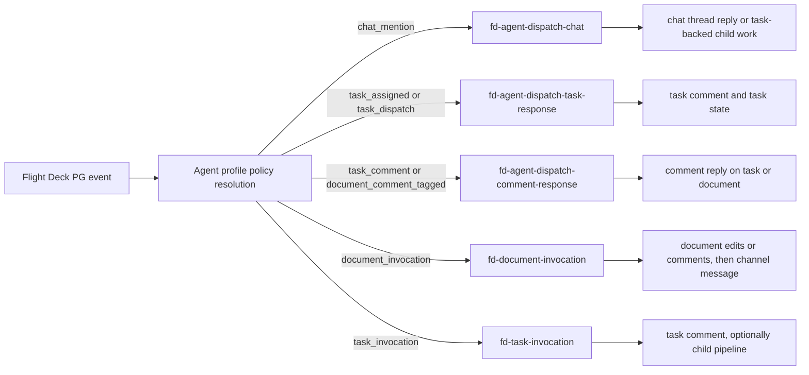
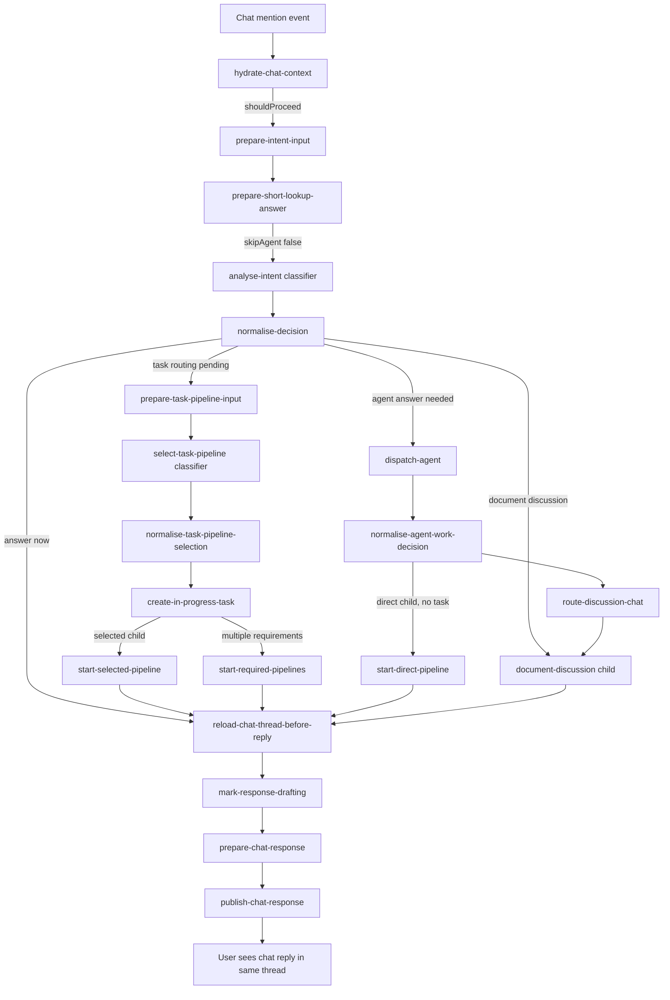
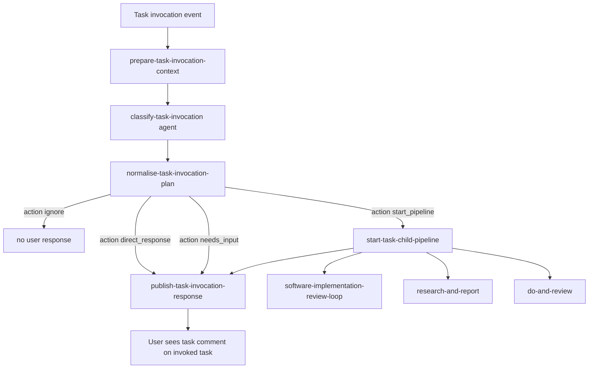
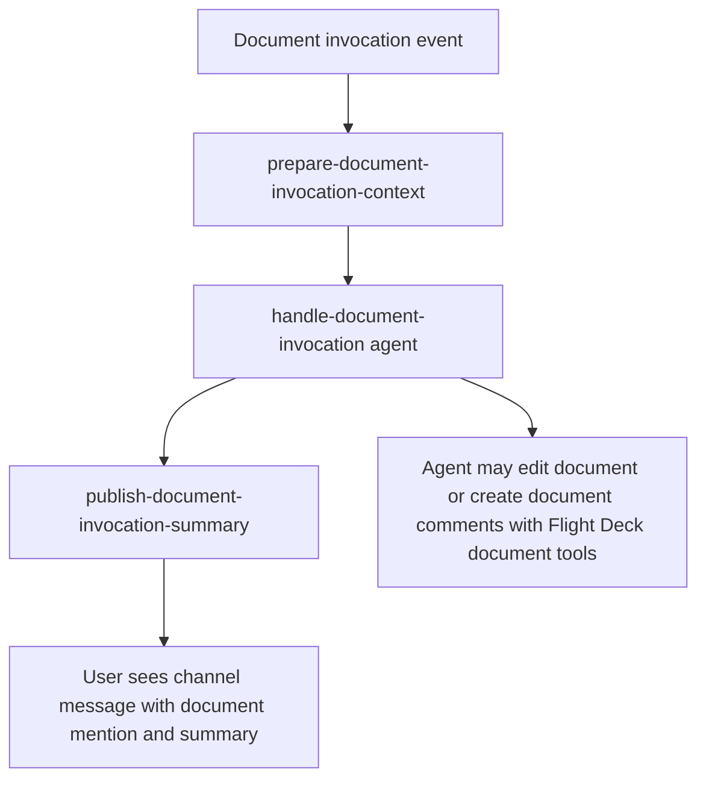
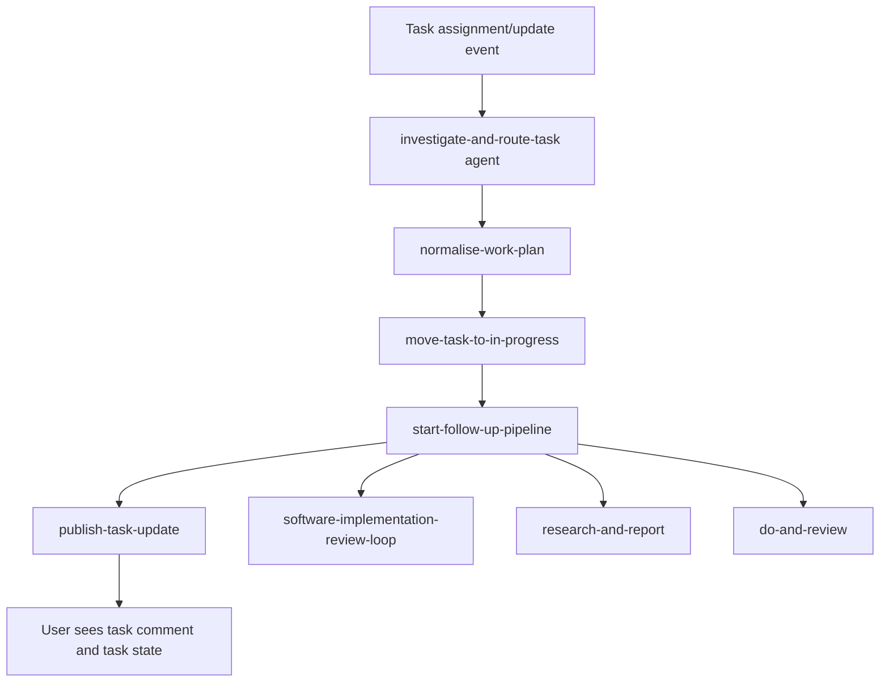
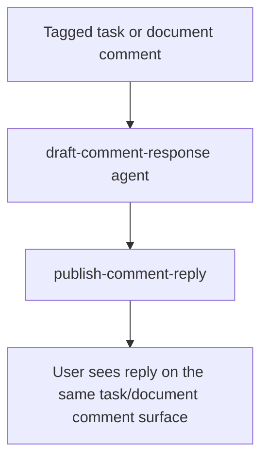
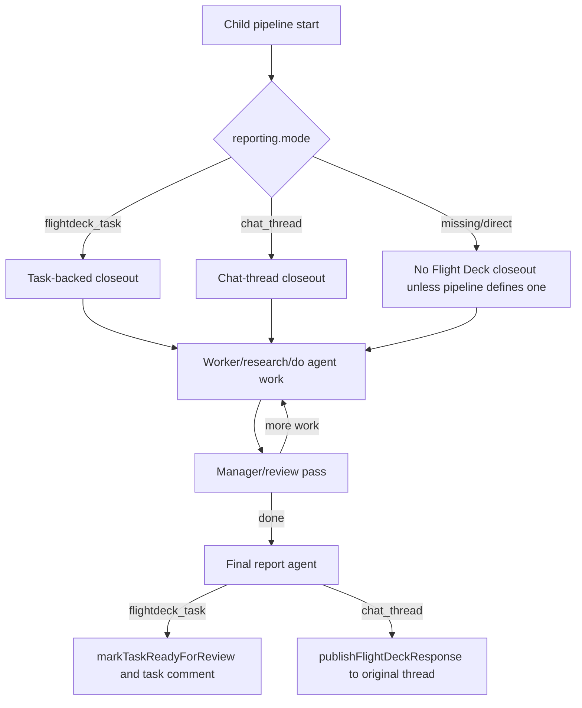
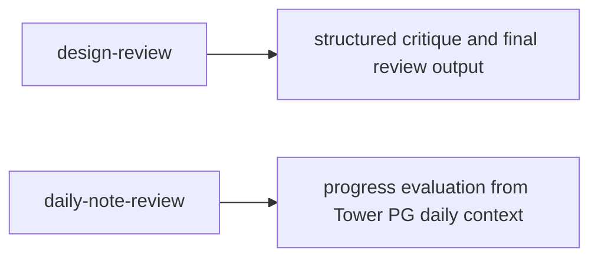

# Autopilot Pipeline Dispatch Map

Last checked: 2026-06-23.

This map covers the built-in Autopilot dispatch pipelines seeded by `src/pipelines/pipeline-loader.ts` and the Flight Deck PG subscription paths in `src/agent-chat/subscription-runtime.ts`.

## Dispatch Entry Points

Default policy targets:

| Event type | Default pipeline | Minimum routing data | User-visible return |
| --- | --- | --- | --- |
| `chat_mention` | `fd-agent-dispatch-chat` | `workspaceId`, `scopeId`, `channelId`, `threadId`, triggering `messageId`, message body/sender | Reply in the same chat thread, or a created task plus chat status |
| `task_assigned` / `task_dispatch` | `fd-agent-dispatch-task-response` | `workspaceId`, `taskId`, task title/body/state, scope/channel when available | Task comment, task state update, optional child closeout |
| `task_comment` | `fd-agent-dispatch-comment-response` | `workspaceId`, `taskId`, `commentId`, comment body/sender | Reply comment on the task |
| `document_comment_tagged` | `fd-agent-dispatch-comment-response` | `workspaceId`, `documentId`, `commentId`, comment body/sender | Reply comment on the document |
| `document_invocation` | `fd-document-invocation` | `workspaceId`, `target documentId`, invocation prompt, channel/scope | Agent edits/comments on document, then channel message with document mention and summary |
| `task_invocation` | `fd-task-invocation` | `workspaceId`, `target taskId`, invocation prompt, channel/scope | Task comment; if child work starts, child pipeline reports back to same task |

## Chat Dispatch

Chat dispatch can produce three broad outcomes:

- Direct chat answer: uses the hydrated thread and publishes through `dispatch.publishFlightDeckResponse`.
- Task-backed work: creates or reuses a task, passes `workPlan.taskId`, `origin.kind = "chat_thread"`, and `reporting.mode = "flightdeck_task"` to the child pipeline, then replies in chat with the task/child status.
- Direct child pipeline: passes thread origin and `reporting.mode = "chat_thread"` so the child returns to the original chat thread.

## Task Invocation

Task invocation child work must receive:

| Field | Purpose |
| --- | --- |
| `workPlan.taskId` | Keeps the invoked task as the reporting surface |
| `workPlan.instructions` | Full agent instruction derived from invocation prompt and task context |
| `workPlan.originalPrompt` | Exact user invocation prompt |
| `workPlan.origin.kind = "flightdeck_task"` | Distinguishes task invocation from chat-origin work |
| `workPlan.origin.taskId` | Lets closeout and comments target the same task |
| `workPlan.reporting.mode = "flightdeck_task"` | Enables deterministic task comments/state closeout |
| `workPlan.workdir` and `workPlan.targetSurface` | Required for software implementation work |

## Document Invocation

Document invocation passes the agent:

- Target document id, title, mention, body snapshot, comments, and local snapshot path.
- Exact invocation prompt.
- Workspace, channel, and scope context.
- Guidance that edits/comments should happen on the document and the summary should be posted back to the channel.

## Task Response Dispatch

This path is for classic task dispatch, not task invocation. It expects an existing task record and lets the agent decide whether to launch a child pipeline. The deterministic publisher reports through the task.

## Comment Response Dispatch

The comment response path should receive the target record id and target type. `dispatch.publishFlightDeckResponse` uses that binding to reply on the correct task or document comment surface.

## Child Work Pipelines

### `software-implementation-review-loop`

Required inputs:

- `workPlan.taskId` when task-backed.
- `workPlan.instructions` / `implementationPrompt`.
- `workPlan.workdir`.
- `workPlan.targetSurface`.
- Optional `designDocumentUrl`, `visualReferences`, `acceptanceCriteria`, and `maxReviewIterations`.

Return behavior:

- `reporting.mode = "flightdeck_task"`: comments progress on the task, moves task to `review` only when manager review is done.
- `reporting.mode = "chat_thread"`: drafts and publishes a final chat-thread response.

### `do-and-review`

Required inputs:

- `workPlan.taskSummary`.
- `workPlan.instructions`.
- Optional `workPlan.taskId`, `workPlan.reporting`, and origin fields.

Return behavior:

- If task-backed, reloads context, drafts final response, and moves the task to review.
- Without task-backed reporting, it runs as direct agent work and returns pipeline output only.

### `research-and-report`

Required inputs:

- `workPlan.taskSummary`.
- `workPlan.instructions` / research question.
- Optional sources, constraints, `taskId`, and reporting context.

Return behavior:

- If task-backed, writes final response to the task and moves it to review.
- Without task-backed reporting, it returns report data in the pipeline output.

## Utility Pipelines

These are seeded pipelines but are not default Flight Deck dispatch targets.

## Main Gaps To Watch

- `fd-agent-dispatch-task-response` is still the legacy default for ordinary task assignment/update dispatch. `fd-task-invocation` is now the default only for explicit task invocation events.
- Direct child-pipeline launches without `reporting.mode` have no guaranteed user-visible closeout. They should be treated as pipeline output unless the launcher sets a reporting target.
- Software work needs a concrete `workdir` and `targetSurface`; otherwise the dispatch path should ask for input instead of guessing.
- Restart is required after code changes before the live Autopilot process can use newly wired dispatch functions.
